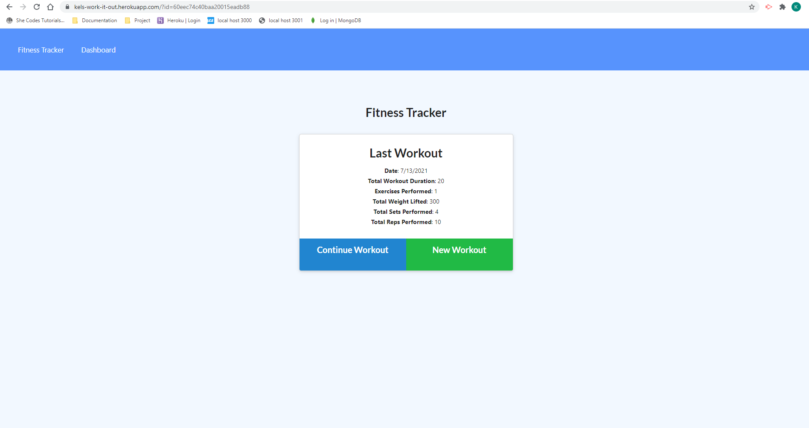
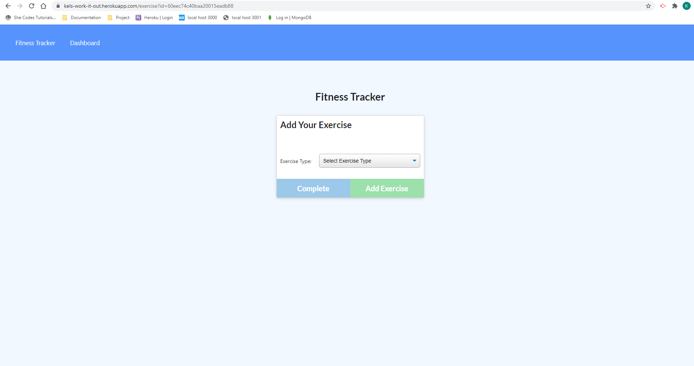
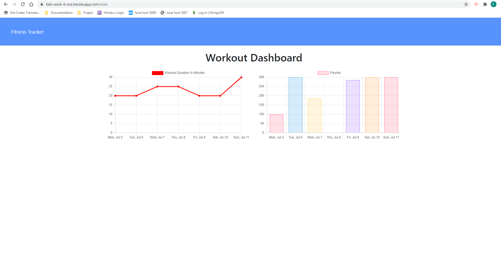

# work-it-out

## Table of Contents

- [Description](#description)
- [Usage](#usage)
- [Links](#links)
- [Screenshots](#screenshots)

## Description

An app to help you with your fitness goals! Track your current workout and view your previous workouts. Create a new exercise workout or continue on with your previous workout.

This App uses:
- MongoDB
- Mongoose
- Express.JS
- Node.JS

## Usage

* click on the "Deployed Website" link!
* click on "add workout" or "continue workout" to log a workout
* click on "Dashboard" to view your previous workouts!

## Links

* gitHub: https://github.com/Kel03-byte/work-it-out
* Deployed website: https://kels-work-it-out.herokuapp.com/

## Screenshots

Homepage

Add An Excercise

Dashboard
